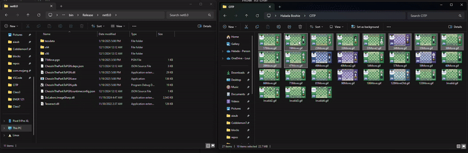

# ChessInTheParkToPGN

ChessInTheParkToPGN is a tool that takes in the gif generated by Discord: Chess In The Park and attempts to put all the moves together and create a pgn file that can be read by chess analysis tools.

## How To Use
### Drag and Drop (Windows)
1. Download the latest release and extract it to any folder
2. Drag any amount of gifs onto the executable file
3. All the PGN files should appear in the folder you're dragging from

### Use the CLI
1. If you are not on windows, ensure dotnet sdk is installed.
2. Download the latest release and extract it to any folder.
3. Open the terminal in the folder you extracted to.
4. If on windows, you can run the program with `./ChessInTheParkToPGN.exe`, otherwise, you can use `dotnet run ./ChessInTheParkToPGN.dll`. For these instructions, i will use `./ChessInTheParkToPGN.exe`.
5. Run the program with a file path to the gif you want to analyze. For example: `./ChessInTheParkToPGN.exe "C:/Users/kyle/CITP/71Move.gif"`. 
6. The PGN File should appear in the folder where you downloaded ChessInTheParkToPGN.

### Advanced CLI Options
`-h`  -  Displays the help message.\
`-o [Path]` -  Custom Path to output the PGN files to.\
`-l [Language]`  -  Sets the language of the inbuilt OCR. In order for it to work in other languages, the .tessdata language files for Tesseract need to be placed in the `/tessdata` folder. Use `-l off` to disable OCR.
